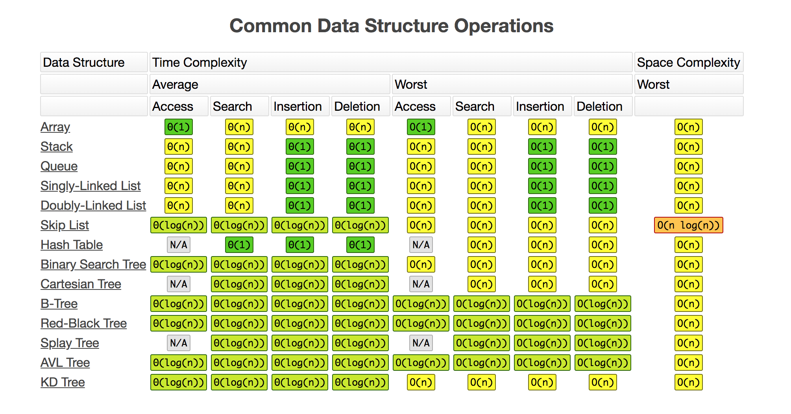

  

  

  

  

  

  

# Dead Tree

Welcome to the documentation of the Dead Tree npm package. This package provides a comprehensive implementation of AVL (Adelson-Velsky and Landis) trees, a type of self-balancing binary search tree. AVL trees maintain a balanced height, ensuring optimal performance for various operations, such as insertion, deletion, and look-up.

## What is an AVL Tree?

An AVL tree is a binary tree in which the heights of the two child subtrees of any nodes differ by no more than one. If, at any time during an operation, this condition is not met, rebalancing is performed to restore the height balance. This property guarantees that the tree remains balanced, resulting in efficient operation times.

## Why use AVL trees?

AVL trees offer several advantages over other data structures, including:

- Efficient Operations: With O(log n) time complexity for insertion, deletion, and look-up operations, AVL trees provide fast and reliable performance. This means that if you need to search for an item on a tree that has 1.048.576 items, in the worst case, you will iterate through **ONLY 20 items**.
- Self-balancing: The automatic balancing mechanism ensures that the tree remains balanced, preventing degradation into a linear structure.
- Versatility: Suitable for applications requiring dynamic set operations, such as dictionaries and recommendation systems.
- Efficient Operations: With O(log n) time complexity for insertion, deletion, and look-up operations, AVL trees provide fast and reliable performance. This means that if you need to search for an item on a tree that has 1.048.576 items, in the worst case, you will iterate through **ONLY 20 items**.

 

## Features of Dead Tree
This npm package focuses on the main core operations of AVL trees:
- Insertion and Deletion: Seamless insertion and deletion operations with automatic rebalancing.
- Traversal methods: Dead Tree gives you support for the three main traversal strategies: in-order, pre-order and post-order.
- Customizable: All methods presented on AVL trees on Dead Tree, can be customized to reach all your necessities.

