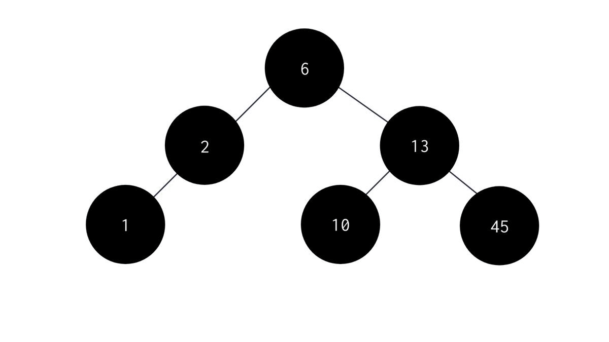

# Iteration

Iteration processes in Dead Tree are, by default, integrated with [javascript iteration protocol](https://developer.mozilla.org/en-US/docs/Web/JavaScript/Reference/Iteration_protocols). This means that you can normally use the javascript default syntax and features to iterate through your tree, like using ```for of```, spread operator and so on.

Keep in mind that iteration process on AVL trees does not work as the same way of another data structures, AVL trees are composed with iteration strategies dedicated for some specific cases and for general cases.

Dead Tree adopt three main iteration strategies used on AVL trees, and this strategies are:
- in-order: The iteration will execute your [Comparator](comparators) class to detect which node is the lowest value, and then return all nodes in ascedent way

<br/>
<div align="center">

</div>

- pre-order: The iteration will execute your [Comparator](comparators) class to traverse through the tree starting, always on left side of each subtree, and all nodes are instantly returned on iteration process

<br/>
<div align="center">

</div>

- post-order: The iteration process will visit the most left node, then visit the right child node and finally the parent node for each subtree

<br/>
<div align="center">

</div>

> Images owners: [devdojo](https://devdojo.com/)

## How to define iteration strategy

In Dead Tree, to define the default iteration strategy, you should set the **behavior** property on **AVLTree** instantiation, like this following example:
```javascript
const tree = new AVLTree<number>({
	comparator: new NumberComparator(),
	behavior: 'in-order',
});
```
By default, if you do not set **behavior** property, AVLTree will use in-order iteration strategy.

> **Watch out**: after you define the iteration strategy, you will not be able to define it again. This does not mean that you will not be able to execute co-routines to navigate through the tree with different strategies, check [this](coroutines) to know how to do it.


## Simple iteration example

To iterate throught your tree, as said on the start of this section, you can simply follow the ```for of``` syntax:
```javascript
// populate the previous tree
for (let i = 0; i < 16; i++) {
	tree.push(i);
}

for(let node of tree) {
	console.log(node.item)
}
```

The output of this actions will be: ```[0,1,2,3,4,5,6,7,8,9,10,11,12,13,14,15]```
